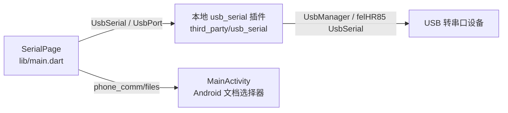

# PhoneComm 架构

PhoneComm 是 Android 前台 USB 串口调试 Demo：Flutter 页面扫描 USB 设备、配置串口、收发文本/HEX/文件并显示日志。应用入口是 `lib/main.dart` 的 `main()`；Android 入口和 USB Host 声明见 `android/app/src/main/AndroidManifest.xml`。当前工程没有后台服务或持久化日志数据库。

- `lib/main.dart`：`_SerialPageState` 持有当前 `UsbPort`、设备列表、接收订阅、计数器、最多 800 条内存日志、最多 20 条发送历史及刷新/定时发送计时器。`parseHex`、`encodeText` 负责发送字节编码。
- `third_party/usb_serial`：`UsbSerial` 和 `UsbPort` 对接 Android 插件；`UsbSerialPlugin` 枚举设备、申请 USB 权限并创建端口；`UsbSerialPortAdapter` 执行串口读写。该目录是随仓库保存的第三方插件副本，版本与上游说明见 `third_party/usb_serial/pubspec.yaml`、`README.md`。
- `MainActivity.kt`：通过 `phone_comm/files` 通道调用 Android 文档选择器。发送文件先复制到缓存，再由 Dart 分块发送；保存日志直接写入用户选定的 URI。

启动和通信流程见 [启动流程](docs/architecture/startup-flow.md)、[模块职责](docs/architecture/modules.md)、[事件与通道](docs/interfaces/event-map.md)；构建和验证见 [构建说明](docs/build-guide/build.md)。

当前配置：`.fvmrc` 指定 Flutter 3.0.5，`pubspec.yaml` 指定 Dart `>=2.17.6 <3.0.0`，`android/app/build.gradle` 的 `compileSdkVersion` 为 33。手机/USB 转串口芯片及目标板兼容性需实机确认；[可行性报告](USB_SERIAL_FEASIBILITY.md)记录了实现前的评估。
