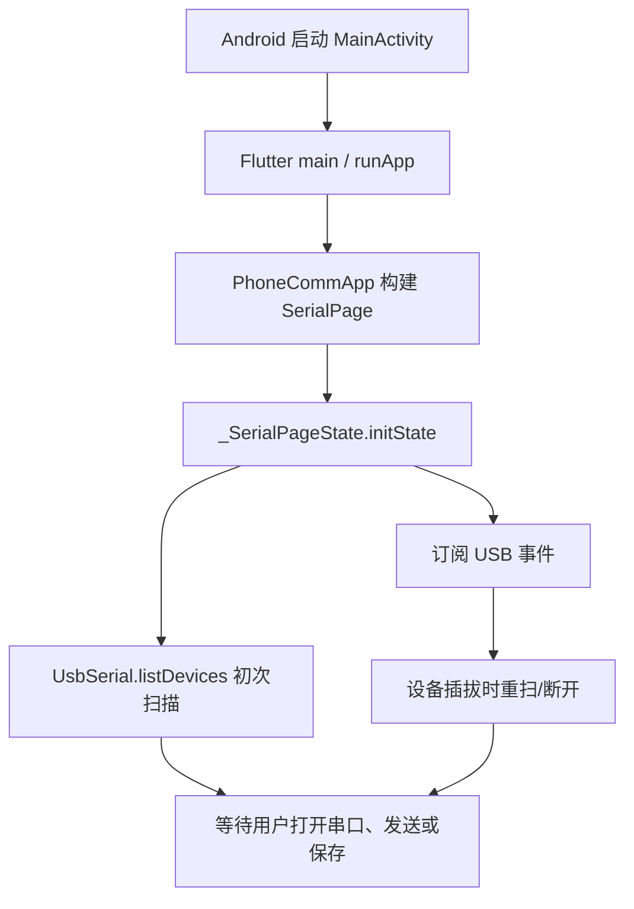

# 启动与稳态运行

范围：Android 前台应用，Flutter 启动见 `lib/main.dart`；系统层 Activity 配置见 `android/app/src/main/AndroidManifest.xml`。Flutter 引擎及插件自动注册由 Flutter 工具链提供，仓库未保存生成的注册代码。

1. `AndroidManifest.xml` 把 `MainActivity` 设为启动 Activity，并声明 `android.hardware.usb.host` 必需；`MainActivity` 在 `configureFlutterEngine()` 注册文件方法通道。
2. `main()` 调用 `runApp(const PhoneCommApp())`，`PhoneCommApp.build()` 创建 `SerialPage`。
3. `_SerialPageState.initState()` 订阅 `UsbSerial.usbEventStream`，调用 `_scanDevices()`。插件 `UsbSerialPlugin.onAttachedToEngine()` 注册 `usb_serial` 方法通道和 USB 插拔广播接收器；`listDevices()` 通过 `UsbManager` 枚举。
4. 页面进入 Flutter 事件循环：用户点击打开触发 `_connect()`，收到字节触发 `_onReceived()`，USB 插拔事件触发重扫或断开；80 ms 刷新计时器合并日志重绘。定时发送由 `_toggleRepeat()` 创建 `Timer.periodic`；没有独立常驻后台任务。依据：`lib/main.dart` 的同名方法。
5. 页面销毁时 `dispose()` 取消订阅/定时器并关闭端口；插件引擎分离时 `UsbSerialPlugin.onDetachedFromEngine()` 注销 USB 广播。具体异步链见 [事件与通道](../interfaces/event-map.md)。
