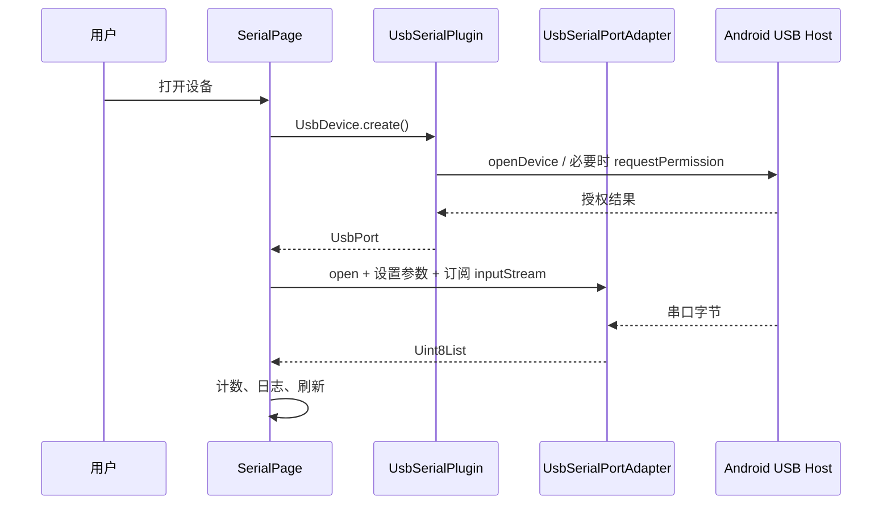

# 事件、字节流与平台通道

范围：当前 Android 前台实现。Flutter 状态和订阅在 `lib/main.dart`；USB 原生实现位于 `third_party/usb_serial`；文件操作位于 `MainActivity.kt`。

| 流程 | 生产/注册 | 分发与处理 | 负载/生命周期 |
| --- | --- | --- | --- |
| USB 插拔 | `UsbSerialPlugin.register()` 注册 Android `BroadcastReceiver`；`UsbSerial.usbEventStream` 建立 `usb_serial/usb_events` 订阅 | `UsbSerialPlugin.usbReceiver.onReceive()` 发出 `UsbEvent`；`_SerialPageState.initState()` 的监听重扫，匹配拔出的已选设备时 `_disconnect()` | 设备信息和 attached/detached 类型；页面 `dispose()` 取消订阅，插件 `unregister()` 移除接收器。 |
| 枚举/打开 | `_scanDevices()` 调 `UsbSerial.listDevices()`；用户调用 `_connect()`/`UsbDevice.create()` | `UsbSerialPlugin.onMethodCall()` 分发 `listDevices`/`create`；`openDevice()` 必要时 `acquirePermissions()`，授权结果由临时广播接收器回调，再创建 `UsbSerialPortAdapter` | USB 设备信息、端口句柄；权限由 Android 弹窗决定，`_generation` 防止过期结果接管页面。 |
| 接收 | `_connect()` 订阅 `port.inputStream`；`UsbSerialPortAdapter.open()` 注册底层 `UsbReadCallback` | `onReceivedData()` 经主线程 `EventSink` 送出字节；`_onReceived()` 更新计数/日志，`_scheduleRefresh()` 延迟重绘 | `Uint8List` 字节块；页面断开时取消订阅并关闭端口。块边界不是协议帧边界。 |
| 发送 | `_send()` 以 `parseHex()` 或 `encodeText()` 生成字节；`_sendFile()` 从缓存文件每次读取 4096 字节 | `UsbPort.write()` 经端口方法通道调用 `UsbSerialPortAdapter.write()` | 发送成功后更新 TX 计数和日志；重复发送计时器由 `_stopRepeat()` 取消。 |
| 文件选择/日志保存 | `_sendFile()`/`_saveLog()` 调 `phone_comm/files` | `MainActivity.configureFlutterEngine()` 注册 `pickFile`/`saveLog`；`onActivityResult()` 处理 Android 文档选择器结果 | 选择文件被复制到缓存，Dart 发送后删除；日志用 UTF-8 写用户选定 URI。一次只保留一个 `pendingResult`。 |

执行上下文：Dart 页面回调在 Flutter UI isolate；插件 USB 广播及 `MethodChannel` 回调由 Android 插件处理，端口读回调通过 `Handler(Looper.getMainLooper())` 发送给 Flutter。这里描述代码路径，不代表任何目标手机已通过 USB 权限或收发实测。
